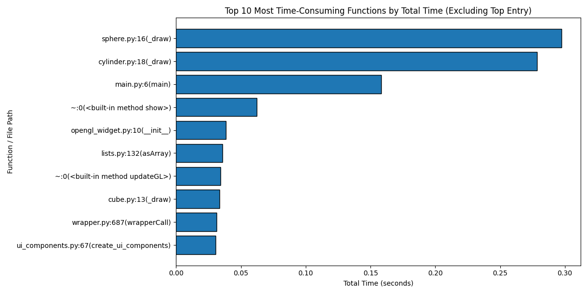
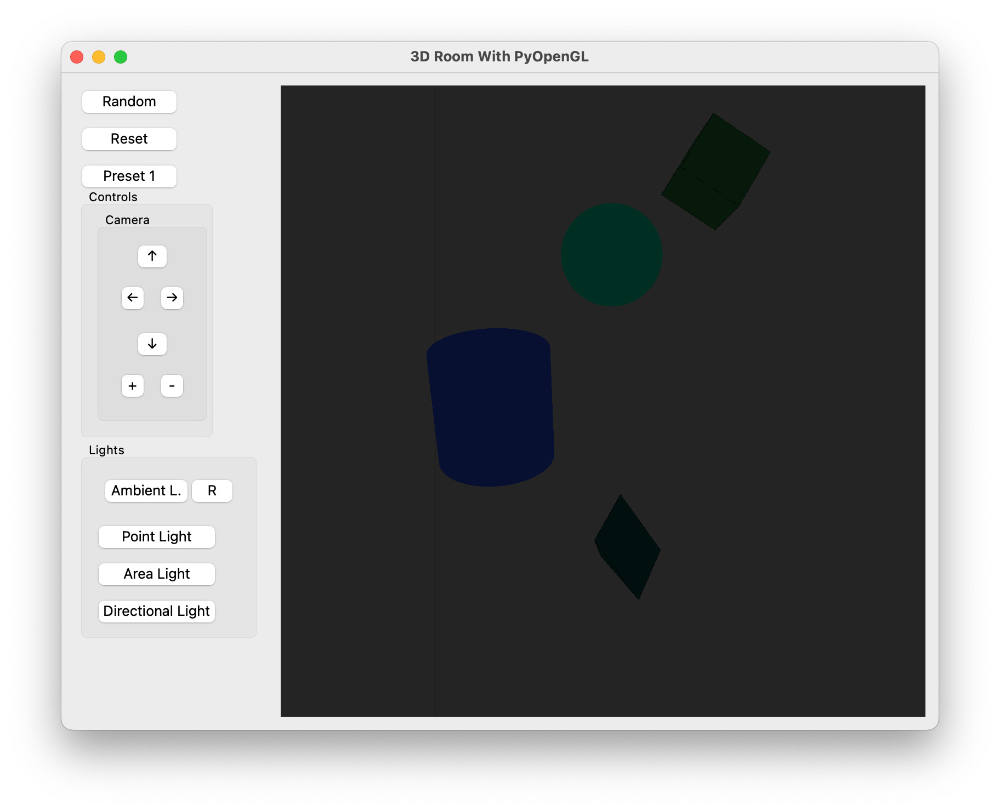
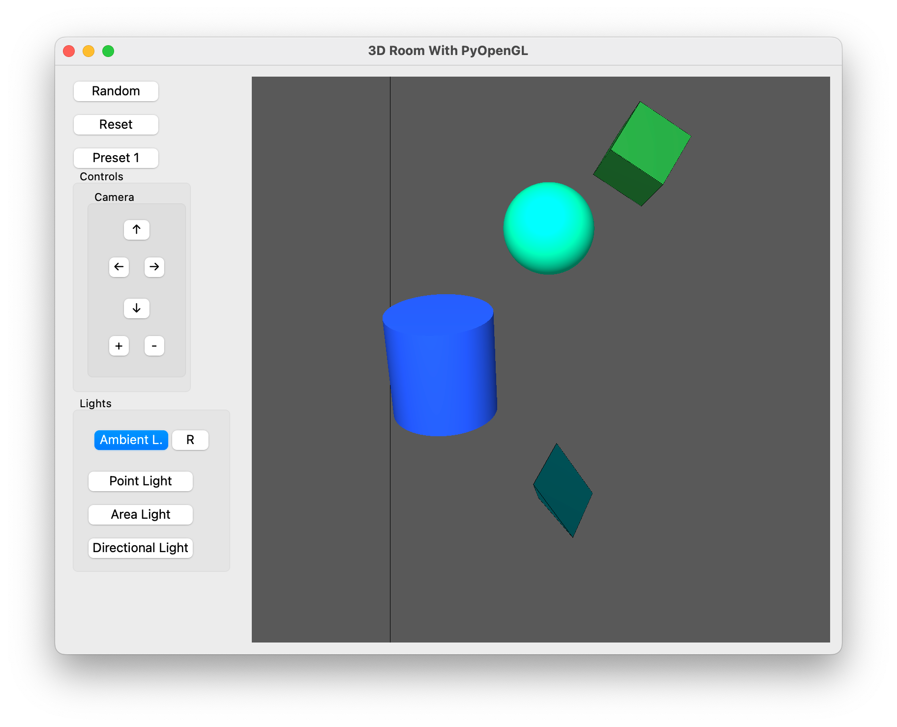
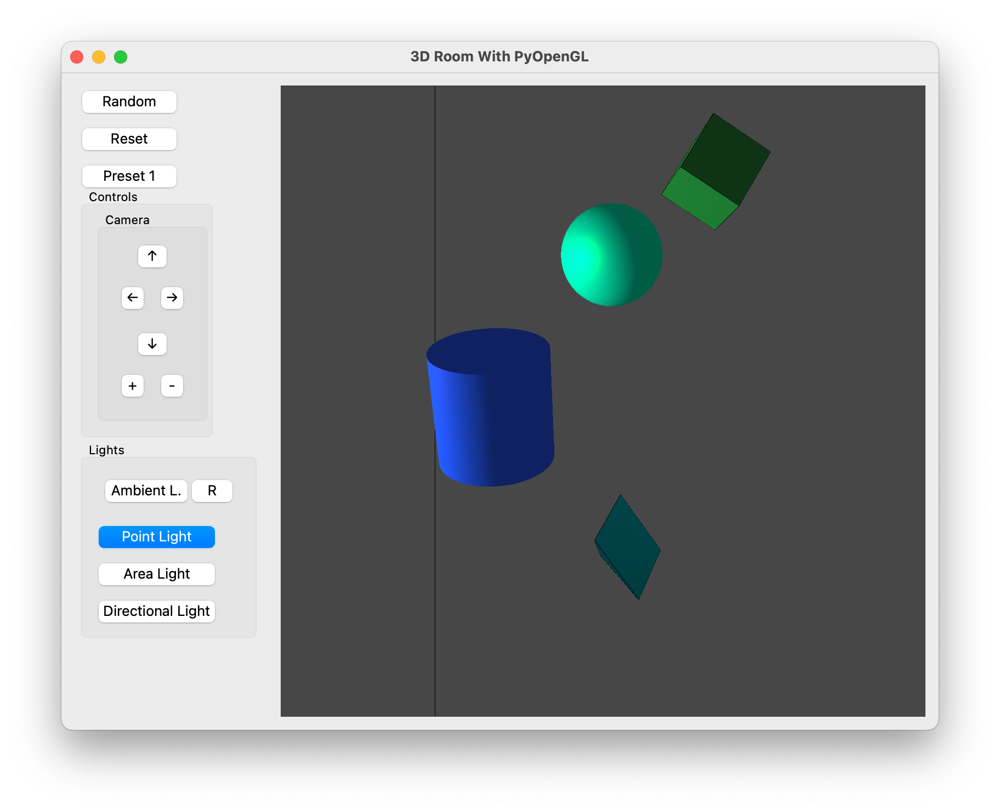
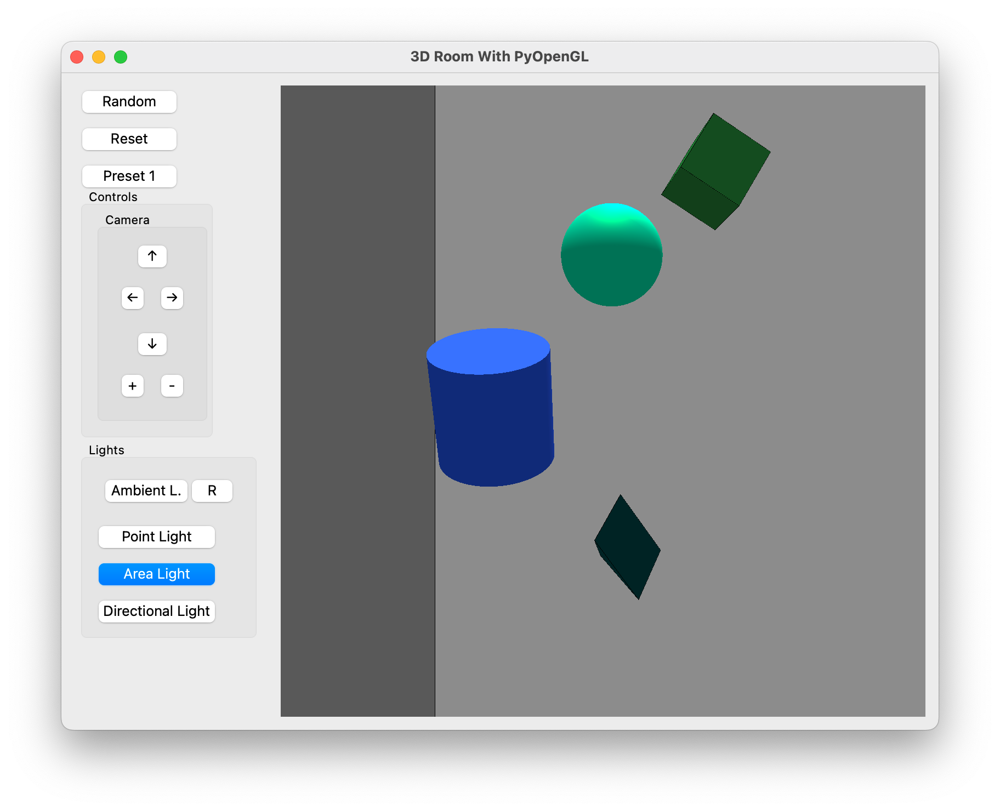
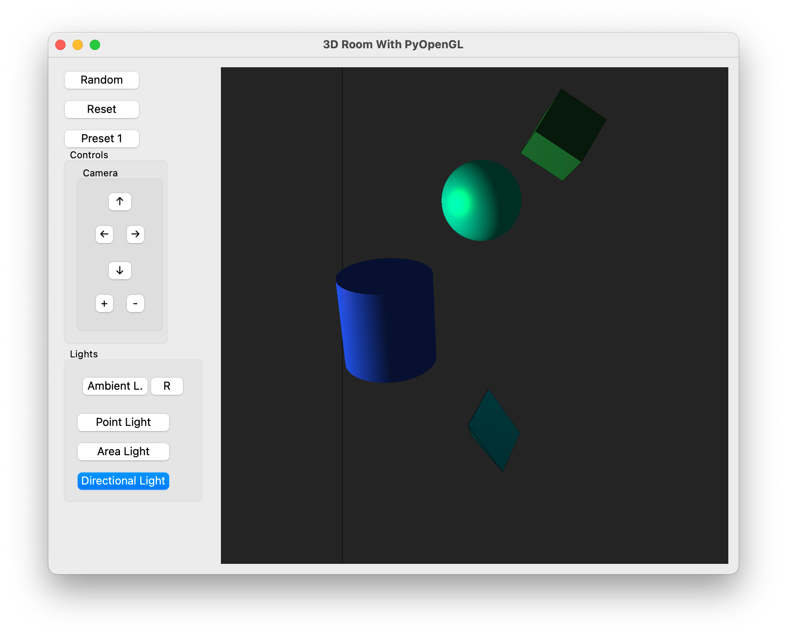
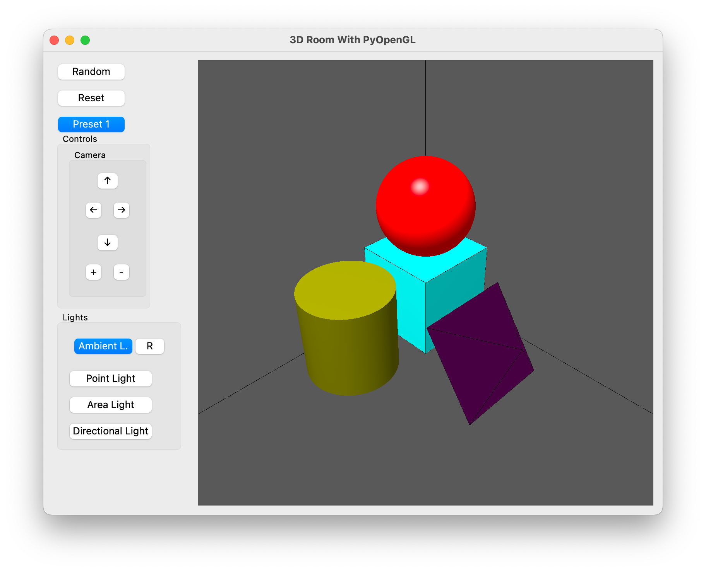
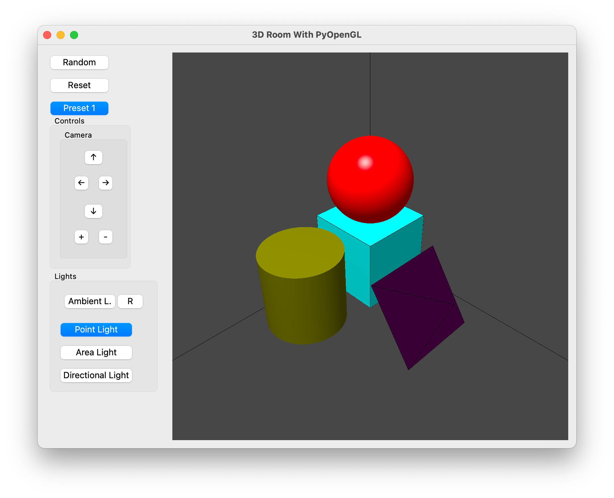
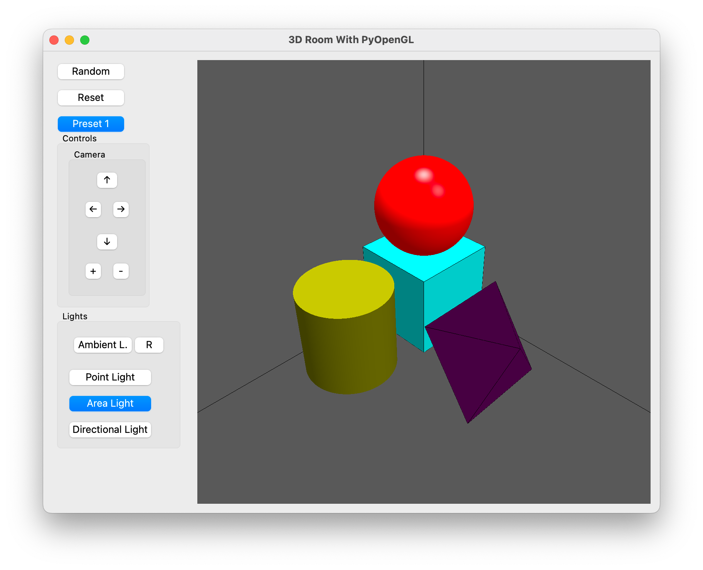
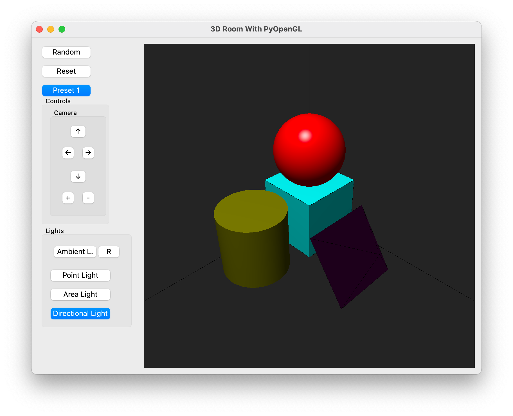

# 3DRoomWithPyOpenGL

## Proje Hakkında

Bu proje, 3 boyutlu uzayda bir 3B model oluşturarak çeşitli geometrik nesneler eklenmesini, yüzey kaplamalarının uygulanmasını ve aydınlatma modelleriyle sahnenin gerçekçi bir şekilde aydınlatılmasını amaçlamaktadır. Proje, İstanbul Ticaret Üniversitesi Bilgisayar Mühendisliği BİL333 Bilgisayar Grafikleri dersi kapsamında gerçekleştirilmiştir.

---

## Grup Bilgileri

| Grup Üyeleri       | Görev Dağılımı                                             |
| ------------------ | ---------------------------------------------------------- |
| Ahmet Servet Polat | Proje yönetimi, odanın oluşturulması                       |
| Kenan Koçoğlu      | Işık kaynaklarının oluşturulması, nesnelerin oluşturulması |
| Mehmet Enes Odabaş | Nesne kaplamaları ve aydınlatma modelinin oluşturulması    |

---

## Proje Özellikleri

### Geometrik Nesneler

-   Küp, küre, silindir ve piramit nesneleri kullanılmıştır.
-   Nesneler, OpenGL kütüphanesi yardımıyla çizilmiştir.
-   Nesnelerin boyutları, konumları, renkleri ve materyalleri rastgele olarak belirlenmektedir.
-   Preset0 ve Preset1 olmak üzere iki farklı nesne seti bulunmaktadır.

### Parlak ve Mat Yüzeyler

-   Her nesne için parlak ve mat yüzeyler kullanılmıştır.
-   Parlak yüzeyler için yansıma katsayısı yüksek, mat yüzeyler için yansıma katsayısı düşüktür.

### Kapalı Oda

-   Küp şeklinde tasarlanmıştır.
-   Duvarlar, taban ve tavan küpün yüzeylerine yüzeyleridir.
-   Kamera odanın içinde hareket edebilir.

### Işık Kaynakları

-   **Ortam Işığı (Ambient Light):** Tüm sahneyi düşük seviyede aydınlatır.
-   **Nokta Işığı (Point Light):** Odanın ortasında bir noktadan yayılan ışık sağlar.
-   **Alan Işığı (Area Light):** Odanın bir köşesinden yayılan ve alanı aydınlatan ışık sağlar.
-   **Yönlü Işık (Directional Light):** Odanın bir duvarından yayılan spot ışık sağlar.
-   **RGB Modu:** Ortam ışığının rengi bir diziye göre değişir.

### Aydınlatma Modeli

-   **Phong Aydınlatma Modeli** kullanılmıştır.
    -   Ambient (Ortam)
    -   Diffuse (Yayılma)
    -   Specular (Yansıma)
-   Global aydınlatma uygulanarak gerçekçi bir ışık yayılımı sağlanmıştır.

---

## Kullanılan Teknolojiler ve Araçlar

-   **Programlama Dili:** Python
-   **Kütüphaneler:** PyOpenGL
-   **Araçlar:**
    -   venv (Sanal ortam yönetimi için)

---

## Projenin Çalıştırılması

1. **Clone the repository**

    ```bash
    git clone https://github.com/AhmetServet/3DRoomWithPyOpenGL.git
    ```

2. **Create a virtual environment**

    ```bash
    python -m venv venv
    ```

3. **Activate the virtual environment**

    ```bash
    source venv/bin/activate # For Unix
    venv\Scripts\activate # For Windows
    ```

4. **Install the required packages**

    ```bash
    pip install -r requirements.txt
    ```

5. **Run the project**

    ```bash
    python main.py
    ```

---

## Proje Performans Ölçümü

### Performans Ölçüm Adımları

1. **Change Directory**

    ```bash
    cd performance
    ```

2. **Install Required Packages**

    ```bash
    pip install -r requirements.txt
    ```

3. **Application Profile Analysis**

    ```bash
    python analyze_profile_data.py
    ```

### Performans Ölçüm Sonuçları

> **Note:** For now, we only measure the top 10 functions by total time. We will add more performance metrics in the future.



## Projeye Ait Ekran Çıktıları












---

## Katkıda Bulunma

Katkıda bulunmak isterseniz, lütfen bir pull request gönderin veya bir issue açın. Her türlü katkı ve geri bildirim memnuniyetle karşılanır.

---
